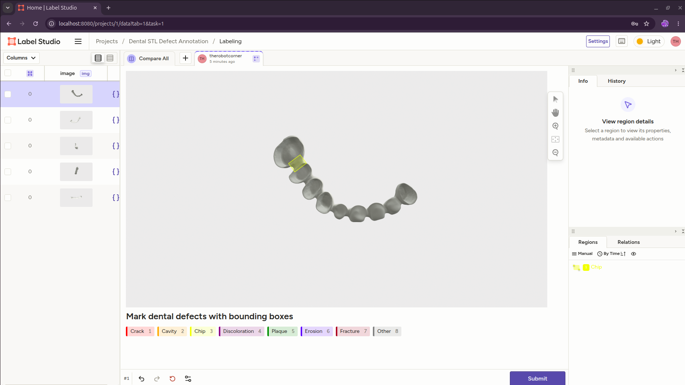

# Dental STL Detection & Segmentation Pipeline

A Python-based workflow for loading dental STL models, capturing multi-view renders, annotating data in Label Studio, training a YOLO OBB detector, and running inference to produce 3D point-cloud segmentations.

---

## Installation

**Requirements:** Python 3.9+

```bash
python3 -m venv .venv
source .venv/bin/activate
pip install open3d numpy opencv-python Pillow ultralytics label-studio label-studio-sdk
```

> **GPU training (recommended):** install the CUDA-enabled PyTorch build before `ultralytics`:
> ```bash
> pip install torch torchvision --index-url https://download.pytorch.org/whl/cu121
> pip install ultralytics
> ```

---

## Step 1 — Render Training Images (`training_data_collection.py`)

### `training_data_collection.py` — Render training images from STL files

Loads every `.stl` file in the `stl/` folder, aligns each mesh to its principal axes, renders 5 views (front, back, left, right, top) and saves them to `renders/`.

```bash
python training_data_collection.py
```

Key configuration (edit at the top of the file):

| Variable | Default | Description |
|---|---|---|
| `STL_DIR` | `stl` | Folder containing source `.stl` files |
| `OUTPUT_DIR` | `renders` | Where rendered images are saved |
| `USE_POINTCLOUD` | `False` | Render as point cloud instead of mesh |

---

## Step 2 — Install and Launch Label Studio

### 2a. Install

```bash
pip install label-studio
```

### 2b. Launch

```bash
# Start the server on the default port 8080
label-studio start --port 8080
```

On first launch you will be prompted to create an account.
After that, the web UI is available at **http://localhost:8080**.

---

## Step 3 — Set Up a Project and Upload Images (GUI)

All project setup is done through the Label Studio web interface at
**http://localhost:8080**.

### 3a. Create an Account (First Launch Only)

1. Open **http://localhost:8080** in your browser.
2. You will see the **Sign Up** page. Enter your email and a password.
3. Click **Create Account**. You are now logged in to the dashboard.

### 3b. Create a New Project

1. On the dashboard, click the **Create Project** button (top-left).
2. In the dialog that appears, fill in the **Project Name** field:
   `Dental STL Defect Annotation`
3. Optionally add a description:
   `Annotate defects on multi-view dental model renders.`
4. Do **not** click Create yet — move to the next tabs first.

### 3c. Upload the Rendered Images

1. In the same Create Project dialog, click the **Data Import** tab.
2. Click **Upload Files** and navigate to your `renders/` folder.
3. Select all five PNG images: `front.png`, `back.png`, `left.png`,
   `right.png`, `top.png`.
4. Wait for the upload progress bar to complete.
5. You should see all tasks listed in the preview table.

### 3d. Configure the Labeling Interface

1. Still in the Create Project dialog, click the **Labeling Setup** tab.
2. In the template gallery on the left, select **Computer Vision → Object
   Detection with Bounding Boxes**.
3. Label Studio will load a default XML config. Click the **Code** toggle
   (top-right of the config panel) to switch to the raw XML editor.
4. **Replace** the entire XML content with the config below (**CHANGE LABELS AS NEEDED**):

```xml
<View>
  <Image name="image" value="$image" />

  <Header value="Mark dental defects with bounding boxes" />

  <RectangleLabels name="defects" toName="image">
    <Label value="Crack"         background="red"    />
    <Label value="Cavity"        background="orange"  />
    <Label value="Chip"          background="yellow"  />
    <Label value="Discoloration" background="purple"  />
    <Label value="Plaque"        background="green"   />
    <Label value="Erosion"       background="blue"    />
    <Label value="Fracture"      background="brown"   />
    <Label value="Other"         background="gray"    />
  </RectangleLabels>

  <TextArea name="notes" toName="image"
            editable="true"
            perRegion="true"
            placeholder="Optional note about this defect..." />
</View>
```

5. Click **Save** (top-right). The project is now created and you will
   be taken to the project's task list showing your uploaded images.

---

## Step 4 — Annotate Defects and Export Results (GUI)

### 4a. Annotate an Image

1. From the project task list, click any row (e.g. `front.png`) to open
   the labeling editor.
2. The image loads in the center. On the right you see the label palette
   with all 8 defect types.
3. To draw a defect annotation:
   - Click a label name (e.g. **Cavity**) in the right panel — it
     highlights to show it is active.
   - Click and drag on the image to draw a bounding box around the defect.
   - Release the mouse. The box appears with the label color and name.
   - (Optional) A text field appears below the box — type a note such as
     `"molar occlusal surface, moderate depth"`.
4. Repeat for every defect visible in the image.
5. To correct a mistake: click the box to select it, then press
   **Backspace / Delete** to remove it, or drag its handles to resize.
6. When finished with this image, click **Submit** (bottom-right). This
   saves the annotation and advances to the next task.
7. Repeat for all images.



### 4b. Review Annotations

1. Return to the project task list by clicking the project name in the
   breadcrumb at the top.
2. Each task row now shows a green checkmark and the annotator name.
3. Click any row to reopen and edit its annotations if needed.
4. The **Filters** bar at the top lets you filter by label, annotator, or
   completion status (e.g. show only unannotated tasks).

### 4c. Export Annotations (DO THIS ONLY WHEN DONE WITH ALL ANNOTATIONS)

1. From the project task list, click the **Export** button (top-right).
2. Label Studio shows a list of export formats. Choose **YOLOv8 OBB with Images**.

3. Click the format name, then click **Export**. A `.zip` file
   downloads to your browser's default download folder.

---

## Step 5 — Train YOLO OBB Model (`split_and_train_obb.py`)

### `split_and_train_obb.py` — Split dataset and train YOLO OBB model

Takes a YOLO-OBB annotated dataset (e.g. exported from CVAT), splits it into train/val sets, writes `data.yaml`, and optionally trains a YOLO OBB model.

**Expected dataset layout:**
```
dataset/
    images/       # .jpg / .png images
    labels/       # matching .txt files in YOLO-OBB format
    classes.txt   # one class name per line
```

**Split only (no training):**
```bash
python split_and_train_obb.py \
    --dataset ./dataset \
    --output  ./dataset_split \
    --no-train
```

**Split + train:**
```bash
python split_and_train_obb.py \
    --dataset ./dataset \
    --output  ./dataset_split \
    --model   yolo26n-obb.pt \
    --epochs  100 \
    --imgsz   1024 \
    --batch   8 \
    --device  0
```

**Train on an already-split dataset:**
```bash
python split_and_train_obb.py \
    --dataset    ./dataset \
    --output     ./dataset_split \
    --skip-split \
    --model      yolo26n-obb.pt
```

Key flags:

| Flag | Default | Description |
|---|---|---|
| `--dataset` | *(required)* | Source dataset folder |
| `--output` | `dataset_split` | Output folder for split data |
| `--val-split` | `0.2` | Fraction of data used for validation |
| `--model` | `yolo26n-obb.pt` | Base checkpoint to train from |
| `--epochs` | `100` | Number of training epochs |
| `--imgsz` | `1024` | Training image size |
| `--batch` | `8` | Batch size |
| `--device` | *(auto)* | `0` for GPU 0, `cpu` for CPU |
| `--patience` | `50` | Early-stopping patience |
| `--no-train` | off | Split only, skip training |
| `--skip-split` | off | Skip splitting, go straight to training |
| `--resume` | off | Resume the last training run |

Trained weights are saved under `runs_obb/train/weights/best.pt`. Copy this to `ai_model/best.pt` to use with `detector.py`.

---

## Step 6 — Run Detection (`detector.py`)

### `detector.py` — Run inference and produce 3D segmentations

Processes every `.stl` file in the `dev/` folder end-to-end:

1. Load and align the mesh
2. Render top & bottom views
3. Run YOLO inference to detect `ToothTop`, `ToothBottom`, and `Connector` regions
4. Select the clean (non-bottom) view
5. Unproject detections back into 3D using the depth buffer
6. Crop matching point-cloud segments, color them, and render an overlay image

```bash
python detector.py
```

All outputs are written to `detections/<mesh_name>/`:

| File | Description |
|---|---|
| `aligned.stl` | Mesh after principal-axis alignment |
| `top.png` / `bottom.png` | Raw rendered views |
| `inference_top.png` / `inference_bottom.png` | Annotated detection debug images |
| `chosen_<view>.png` | The view selected for segmentation |
| `overlay_top.png` | Final mesh + colored point-cloud overlay |

Key configuration (edit at the top of the file):

| Variable | Default | Description |
|---|---|---|
| `STL_DIR` | `dev` | Folder containing `.stl` files to process |
| `OUTPUT_DIR` | `detections` | Root output folder |
| `MODEL_PATH` | `ai_model/best.pt` | Trained YOLO detector |
| `CONF_THRESHOLD` | `0.25` | Minimum detection confidence |
| `SHOW_CONFIDENCE` | `False` | Show confidence scores on debug images |

---

## Typical End-to-End Workflow

```
stl/                      ← place raw STL files here
  └─ ...

1. python training_data_collection.py
        → renders/        ← rendered images for annotation

2. Annotate in Label Studio (YOLO-OBB format), export to dataset/

3. python split_and_train_obb.py --dataset ./dataset --output ./dataset_split \
       --model yolo26n-obb.pt --epochs 100 --device 0
        → runs_obb/train/weights/best.pt

4. cp runs_obb/train/weights/best.pt ai_model/best.pt

5. Place STLs to detect in dev/
   python detector.py
        → detections/<mesh>/overlay_top.png
```
