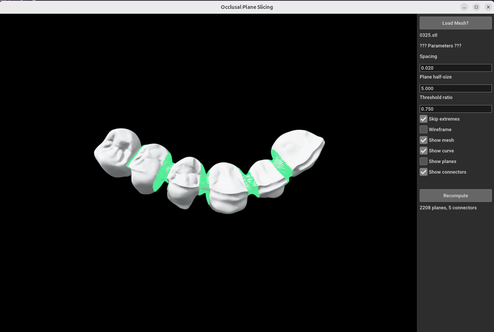

# Dental Workflow — Occlusal-Plane Slicing

Segment dental STL meshes by slicing along the occlusal curve, detecting connector regions between teeth.

## Setup

### Create a virtual environment

**Linux / macOS:**

```bash
python3 -m venv .venv
source .venv/bin/activate
```

**Windows (PowerShell):**

```powershell
python -m venv .venv
.venv\Scripts\Activate.ps1
```

**Windows (cmd):**

```cmd
python -m venv .venv
.venv\Scripts\activate.bat
```

### Install dependencies

```bash
pip install numpy open3d trimesh scipy
```

## Usage

Launch the GUI with no file (load via the **Load Mesh…** button):

```bash
python3 segment.py
```

Launch with an STL preloaded:

```bash
python3 segment.py stl/0325.stl
```

Override default parameters from the command line:

```bash
python3 segment.py stl/0325.stl --spacing 2.0
python3 segment.py stl/0325.stl --spacing 1.5 --plane-size 8 --wireframe
python3 segment.py stl/0325.stl --threshold-ratio 0.6
python3 segment.py stl/0325.stl --no-skip-extremes
```

## Arguments

| Argument | Description | Default |
|----------|-------------|---------|
| `stl` | Path to input STL file (optional; can load from GUI) | — |
| `--spacing` | Distance between slicing planes | `0.02` |
| `--plane-size` | Half-size of rendered slice planes | `5.0` |
| `--wireframe` | Render mesh as wireframe instead of solid | off |
| `--threshold-ratio` | Z-extent ratio below which a plane is a connector | `0.75` |
| `--no-skip-extremes` | Keep connector groups at the first/last plane | off (extremes skipped by default) |

## GUI Controls

The application opens an interactive window with a 3D viewport and a settings panel:

- **Load Mesh…** — open a file dialog to select an STL file
- **Spacing** — distance between slicing planes along the occlusal curve
- **Plane half-size** — size of the visualized cutting planes
- **Threshold ratio** — Z-extent ratio for classifying a slice as a connector
- **Skip extremes** — discard connector groups at the ends of the arch
- **Wireframe** — toggle wireframe vs. solid mesh rendering
- **Show mesh / curve / planes / connectors** — toggle visibility of each element
- **Recompute** — recalculate planes and connectors with the current parameter values


