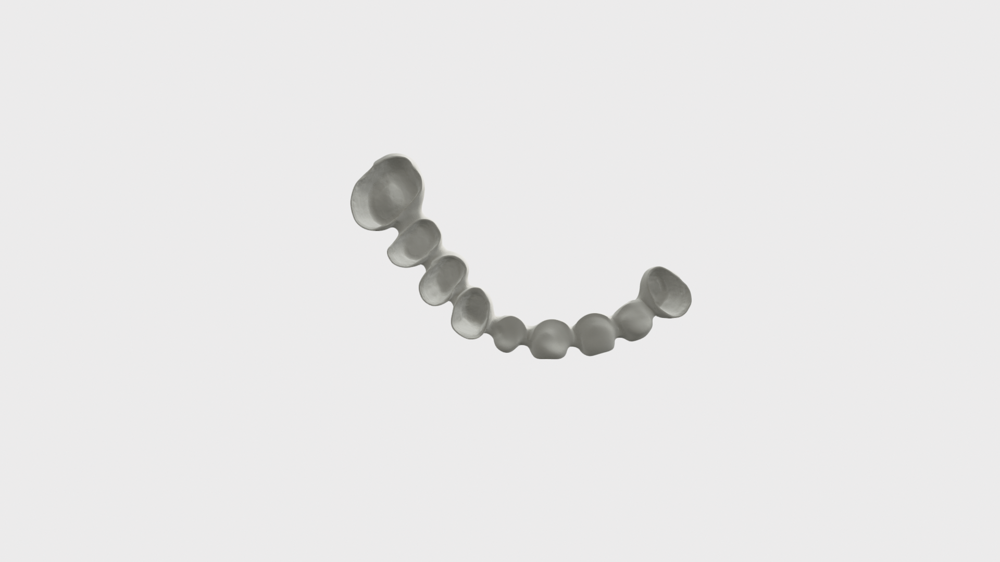
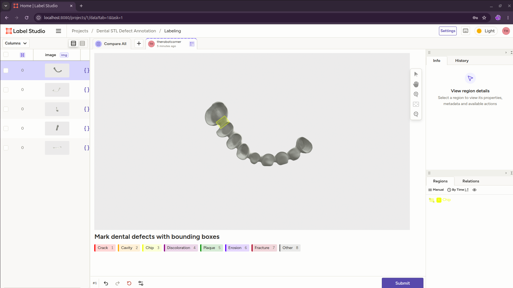

# Dental STL Defect Annotation Pipeline

A Python-based workflow for loading dental STL models, capturing multi-view renders, and annotating defects in Label Studio.

---

## Step 1 - Install Needed Software in Python Virtual Environment

```bash
python3 -m venv .venv
source .venv/bin/activate
pip install open3d numpy Pillow label-studio label-studio-sdk
```

---

## Step 2 — Load STL file and Render Five Views and Save Screenshots

Each view is defined by positioning a virtual camera around the mesh's center.
The helper below uses Open3D's offscreen renderer so no GUI window is needed.

```python
import os
import math
import open3d as o3d
import numpy as np

# ── Configuration ──────────────────────────────────────────────
STL_PATH       = "0035.stl"
OUTPUT_DIR     = "renders"
IMAGE_WIDTH    = 1920
IMAGE_HEIGHT   = 1080


os.makedirs(OUTPUT_DIR, exist_ok=True)

# ── Load mesh ──────────────────────────────────────────────────
mesh = o3d.io.read_triangle_mesh(STL_PATH)
mesh.compute_vertex_normals()
mesh.paint_uniform_color([0.95, 0.93, 0.88])

# Center the mesh at the origin and get its bounding sphere
mesh.translate(-mesh.get_center())
bbox   = mesh.get_axis_aligned_bounding_box()
extent = bbox.get_max_extent()
radius = extent * 1.5            # camera distance from center


# ── Define the five view directions ────────────────────────────
# Each entry: (name, eye_position, up_vector)
VIEWS = {
    "front":  {"eye": [0,  0,  radius], "up": [0, 1, 0]},
    "back":   {"eye": [0,  0, -radius], "up": [0, 1, 0]},
    "left":   {"eye": [-radius, 0, 0],  "up": [0, 1, 0]},
    "right":  {"eye": [radius,  0, 0],  "up": [0, 1, 0]},
    "top":    {"eye": [0, radius,  0],  "up": [0, 0, -1]},
}

CENTER = [0.0, 0.0, 0.0]         # look-at target


# ── Capture helper using OffscreenRenderer ─────────────────────
def capture_view(mesh, eye, up, center, width, height, save_path):
    """Render the mesh from a given viewpoint and save to disk."""
    renderer = o3d.visualization.rendering.OffscreenRenderer(width, height)
    renderer.scene.set_background([1.0, 1.0, 1.0, 1.0])  # white bg

    # Material
    mat = o3d.visualization.rendering.MaterialRecord()
    mat.shader = "defaultLit"
    mat.base_color = [0.95, 0.93, 0.88, 1.0]

    renderer.scene.add_geometry("dental_mesh", mesh, mat)

    # Camera
    renderer.setup_camera(
        60.0,                       # vertical field-of-view (degrees)
        np.array(center),           # look-at point
        np.array(eye),              # camera position
        np.array(up)                # up vector
    )

    # Render and save
    img = renderer.render_to_image()
    o3d.io.write_image(save_path, img)
    print(f"  ✓ saved {save_path}")

    renderer.scene.remove_geometry("dental_mesh")
    del renderer


# ── Render each view ───────────────────────────────────────────
filename = os.path.basename(STL_PATH)
saved_paths = []

for name, params in VIEWS.items():
    path = os.path.join(OUTPUT_DIR, f"{os.path.splitext(filename)[0]}_{name}.png")
    capture_view(
        mesh,
        eye=params["eye"],
        up=params["up"],
        center=CENTER,
        width=IMAGE_WIDTH,
        height=IMAGE_HEIGHT,
        save_path=path,
    )
    saved_paths.append(path)

print(f"\nAll {len(saved_paths)} views saved to '{OUTPUT_DIR}/'")
```

---

## Step 3 — Install and Launch Label Studio

### 3a. Install

```bash
pip install label-studio
```

### 3b. Launch

```bash
# Start the server on the default port 8080
label-studio start --port 8080
```

On first launch you will be prompted to create an account.
After that, the web UI is available at **http://localhost:8080**.

---

## Step 4 — Set Up a Project and Upload Images (GUI)

All project setup is done through the Label Studio web interface at
**http://localhost:8080**.

### 4a. Create an Account (First Launch Only)

1. Open **http://localhost:8080** in your browser.
2. You will see the **Sign Up** page. Enter your email and a password.
3. Click **Create Account**. You are now logged in to the dashboard.

### 4b. Create a New Project

1. On the dashboard, click the **Create Project** button (top-left).
2. In the dialog that appears, fill in the **Project Name** field:
   `Dental STL Defect Annotation`
3. Optionally add a description:
   `Annotate defects on multi-view dental model renders.`
4. Do **not** click Create yet — move to the next tabs first.

### 4c. Upload the Rendered Images

1. In the same Create Project dialog, click the **Data Import** tab.
2. Click **Upload Files** and navigate to your `renders/` folder.
3. Select all five PNG images: `front.png`, `back.png`, `left.png`,
   `right.png`, `top.png`.
4. Wait for the upload progress bar to complete.
5. You should see all tasks listed in the preview table.

### 4d. Configure the Labeling Interface

1. Still in the Create Project dialog, click the **Labeling Setup** tab.
2. In the template gallery on the left, select **Computer Vision → Object
   Detection with Bounding Boxes**.
3. Label Studio will load a default XML config. Click the **Code** toggle
   (top-right of the config panel) to switch to the raw XML editor.
4. **Replace** the entire XML content with the config below (**CHANGE LABELS AS NEEDED**):

```xml
<View>
  <Image name="image" value="$image" />

  <Header value="Mark dental defects with bounding boxes" />

  <RectangleLabels name="defects" toName="image">
    <Label value="Crack"         background="red"    />
    <Label value="Cavity"        background="orange"  />
    <Label value="Chip"          background="yellow"  />
    <Label value="Discoloration" background="purple"  />
    <Label value="Plaque"        background="green"   />
    <Label value="Erosion"       background="blue"    />
    <Label value="Fracture"      background="brown"   />
    <Label value="Other"         background="gray"    />
  </RectangleLabels>

  <TextArea name="notes" toName="image"
            editable="true"
            perRegion="true"
            placeholder="Optional note about this defect..." />
</View>
```

5. Click **Save** (top-right). The project is now created and you will
   be taken to the project's task list showing your uploaded images.

---

## Step 5 — Annotate Defects and Export Results (GUI)

### 5a. Annotate an Image

1. From the project task list, click any row (e.g. `front.png`) to open
   the labeling editor.
2. The image loads in the center. On the right you see the label palette
   with all 8 defect types.
3. To draw a defect annotation:
   - Click a label name (e.g. **Cavity**) in the right panel — it
     highlights to show it is active.
   - Click and drag on the image to draw a bounding box around the defect.
   - Release the mouse. The box appears with the label color and name.
   - (Optional) A text field appears below the box — type a note such as
     `"molar occlusal surface, moderate depth"`.
4. Repeat for every defect visible in the image.
5. To correct a mistake: click the box to select it, then press
   **Backspace / Delete** to remove it, or drag its handles to resize.
6. When finished with this image, click **Submit** (bottom-right). This
   saves the annotation and advances to the next task.
7. Repeat for all images.



### 5b. Review Annotations

1. Return to the project task list by clicking the project name in the
   breadcrumb at the top.
2. Each task row now shows a green checkmark and the annotator name.
3. Click any row to reopen and edit its annotations if needed.
4. The **Filters** bar at the top lets you filter by label, annotator, or
   completion status (e.g. show only unannotated tasks).

### 5c. Export Annotations (DO THIS ONLY WHEN DONE WITH ALL ANNOTATIONS)

1. From the project task list, click the **Export** button (top-right).
2. Label Studio shows a list of export formats. Choose **YOLOv8 OBB with Images**.

3. Click the format name, then click **Export**. A `.zip` file
   downloads to your browser's default download folder.

---